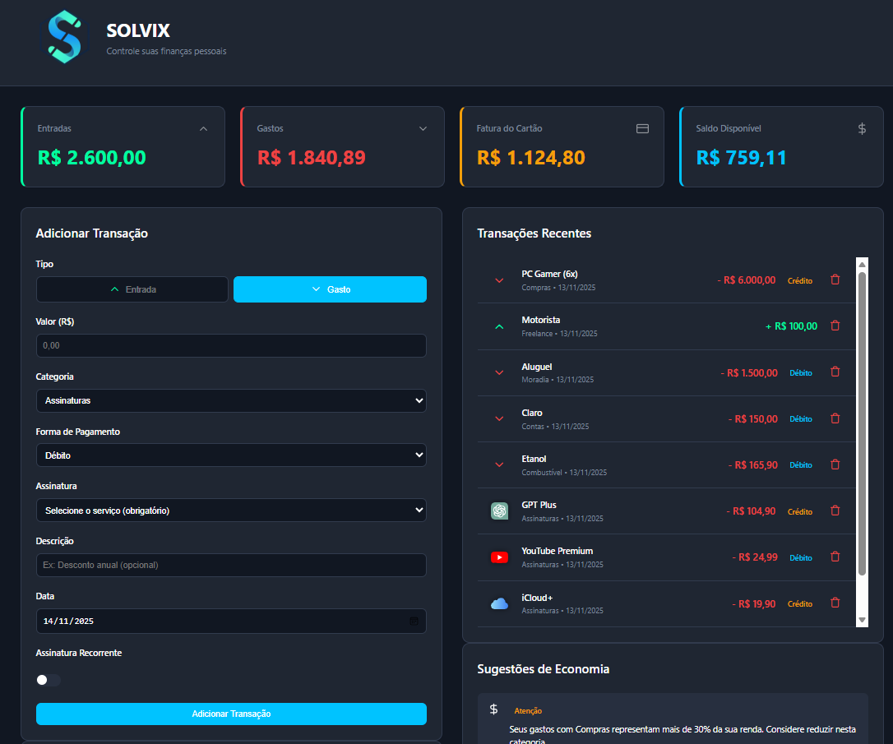
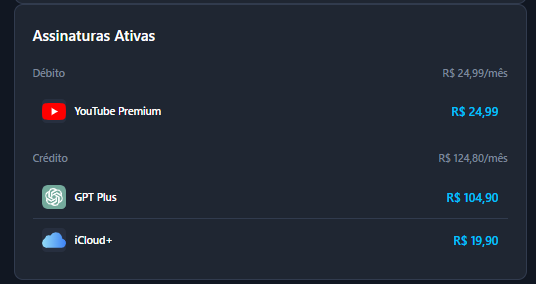
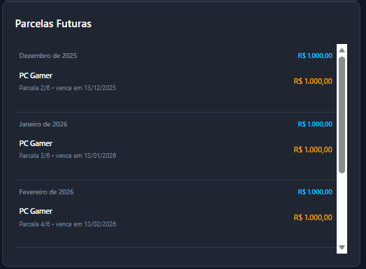

# 💰 Solvix: Seu Gestor Financeiro Pessoal, Simples e Gratuito

> Controle suas finanças pessoais sem mensalidade, sem anúncios e sem complicação.

---

## 💡 Cansado de apps de controle financeiro complexos e pagos?

**Nós também.**  
O **Solvix** nasceu da frustração de querer organizar a vida financeira e só encontrar:

- aplicativos cheios de telas e funções que você nunca usa;
- planos pagos para liberar recursos básicos;
- anúncios por todos os lados.

**O Solvix é o oposto disso.**

Ele é um gestor financeiro **minimalista**, **focado no essencial** e **100% gratuito**, pensado para rodar localmente no seu computador, com seus dados sob seu controle.

Com o Solvix você consegue:

- Registrar **entradas**, **gastos** e **assinaturas recorrentes**;
- Acompanhar sua **fatura do cartão**, inclusive compras **parceladas**;
- Visualizar **sugestões inteligentes** de economia com base nos seus hábitos.

---

## ✨ Recursos em Destaque

- **Visão Geral Clara**  
  • Saldo disponível  
  • Entradas totais  
  • Gastos  
  • Fatura do cartão (incluindo parcelados)

- **Controle de Assinaturas**  
  • Separa assinaturas por **débito** e **crédito**  
  • Mostra o total mensal de cada grupo

- **Parcelas Futuras**  
  • Compras no crédito parceladas são exibidas por mês  
  • Você enxerga o impacto das parcelas nos próximos meses

- **Sugestões de Economia**  
  • Alertas quando uma categoria passa de um limite saudável  
  • Mensagens positivas quando você está economizando bem

- **Interface Dark, Limpa e Direta**  
  • Visual focado nos números  
  • Layout pensado para uso diário sem distrações

---

## 🖥️ Veja o Solvix em ação

> Salve seus prints na pasta `app/static/img` (ou equivalente) usando estes nomes
> ou adapte os caminhos abaixo para os arquivos que você criar.

### 📊 Dashboard Principal



Visão geral com **Entradas**, **Gastos**, **Fatura do Cartão** e **Saldo Disponível**, além da área para **Adicionar Transações**.

---

### 🔁 Assinaturas Ativas



Bloco dedicado para **Assinaturas Ativas**, separando o total por **débito** e **crédito**, com valores mensais e logo dos serviços.

---

### 📅 Parcelas Futuras



Lista de **Parcelas Futuras**, agrupadas por mês, mostrando:

- descrição da compra,
- qual parcela é (ex: `2/5`),
- data de vencimento,
- e o valor de cada parcela.

---

## 🛠️ Como Começar (Setup Rápido)

Em poucos minutos você já consegue registrar suas primeiras transações.

### 1. Pré-requisitos

- Python 3.x instalado  
- `pip` funcionando normalmente

### 2. Clonar o Repositório

```bash
git clone https://github.com/DMendes7/Solvix.git
cd Solvix